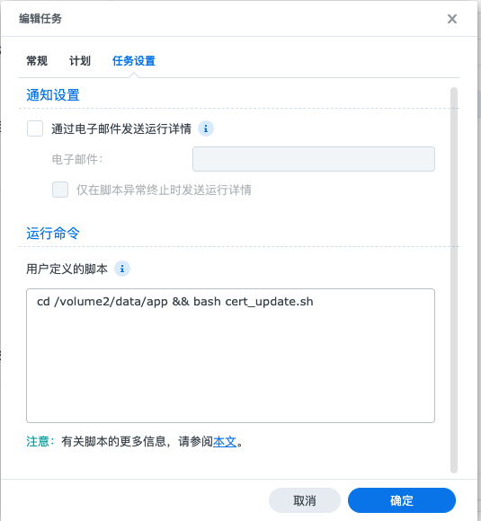

## 安装lego
### 下载
在github获取相应平台软件 [lego release](https://github.com/go-acme/lego/releases)
### 解压安装
为了方便使用，将解压的`lego`二进制文件复制到`/usr/local/bin/`
## 创建更新任务
### 新建脚本文件
保存脚本文件到你喜欢的位置，本例中保存至`/volume1/data/cert/cert_auto_renew.sh`，脚本使用cloudflare dns演示，[查看更多dns服务商](https://go-acme.github.io/lego/dns/)
```shell
#!/bin/bash
export CLOUDFLARE_DNS_API_TOKEN=* # 此处替换为本人的token
DOMAIN="nas.wangyanzu.com" # 此处替换为本人nas域名
LEGO_CERT_PATH=".lego/certificates"
SYNOLOGY_CERTIFICATE_PATH="/usr/syno/etc/certificate"
SYNOLOGY_DEFAULT_CERTIFICATE_NAME=$(cat "${SYNOLOGY_CERTIFICATE_PATH}/_archive/DEFAULT" | tr -d "\n")
SYNOLOGY_DEFAULT_CERTIFICATE_PATH="${SYNOLOGY_CERTIFICATE_PATH}/_archive/${SYNOLOGY_DEFAULT_CERTIFICATE_NAME}"

# 申请域名
lego --email i@wangyanzux.com --dns cloudflare --domains $DOMAIN run

# 部署证书
/bin/sh -c "cp '${LEGO_CERT_PATH}/${DOMAIN}.crt' ${SYNOLOGY_DEFAULT_CERTIFICATE_PATH}/fullchain.pem"
/bin/sh -c "cp '${LEGO_CERT_PATH}/${DOMAIN}.crt' ${SYNOLOGY_DEFAULT_CERTIFICATE_PATH}/cert.pem"
/bin/sh -c "cp '${LEGO_CERT_PATH}/${DOMAIN}.key' ${SYNOLOGY_DEFAULT_CERTIFICATE_PATH}/privkey.pem"

# 刷新证书
synow3tool --gen-all
synow3tool --nginx=reload
```
### 创建定时任务
因为let's encrypt 证书有效期为3个月，所以每周执行一次更新脚本即可

`cd /volume1/data/cert && bash cert_auto_renew.sh`
